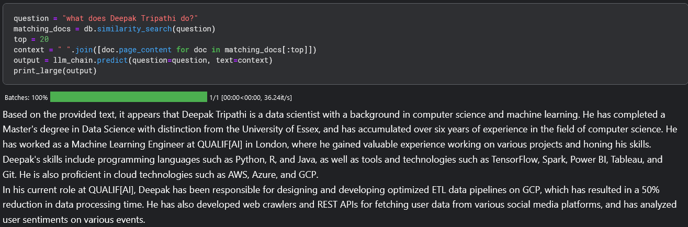
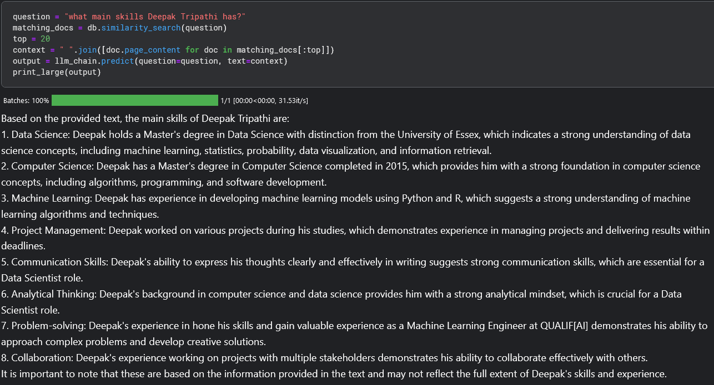
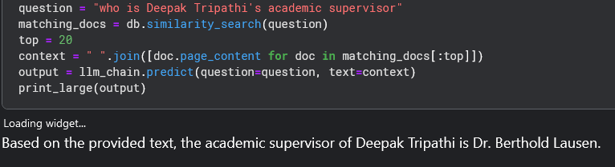

# Document-based_question_answering_system_using_LLamaV2-7b
I have tried exploring LLama-v2-7b model with chroma db and langchain to create document based question answering system customized on my own data. I asked it multiple questions and the generated results were pretty impressive. Note that these answers were generated using only three documents: my cover letter, resume and my dissertation.

Below are the sample result:

# Quest1:   what does Deepak Tripathi do?
# Result

# Quest2:   what main skills Deepak Tripathi has?
# Result

# Quest3:   what was the conclusion of the project Deepak Tripathi worked on?
# Result

